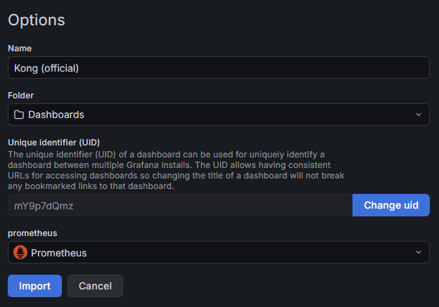

# Thiết lập môi trường

## Cài đặt WSL (chỉ trên Windows)
Trong PowerShell:
```sh
wsl --install
```
## Cài đặt Docker
Hướng dẫn chính thức:
- [Windows](https://docs.docker.com/desktop/setup/install/windows-install/)
- [Linux](https://docs.docker.com/desktop/setup/install/linux/)

Mở Docker, vào **Settings > Resourses > WSL integration** --> **Enable**

## Cài đặt minikube và kubectl
Hướng dẫn chính thức:
[Cài đặt Minikube](https://kubernetes.io/vi/docs/tasks/tools/install-minikube/)

## Cài đặt k6 (công cụ load testing)
Hướng dẫn chính thức: [Grafana k6 docs](https://grafana.com/docs/k6/latest/set-up/install-k6/)

# Cấu hình SMTP để gửi mail cảnh báo
## Tạo file `k8s/grafana/grafana-smtp-secret.yaml` để thêm App Password
```yaml
apiVersion: v1
kind: Secret
metadata:
  name: grafana-smtp-secret
type: Opaque
stringData:
  smtp-password: <app password> # Thêm password ở đây
```
Tạo Google App Password: [App Password](https://support.google.com/mail/answer/185833?hl=en#)

Uncomment khai báo các biến liên quan trong `k8s/grafana/grafana-deployment.yaml`:

```yaml
- name: GF_SMTP_ENABLED
  value: "true"
- name: GF_SMTP_HOST
  value: "smtp.gmail.com:587"
- name: GF_SMTP_USER
  value: "thaidev247@gmail.com"
- name: GF_SMTP_PASSWORD
  valueFrom:
    secretKeyRef:
      name: grafana-smtp-secret
      key: smtp-password
- name: GF_SMTP_FROM_ADDRESS
  value: "thaidev247@gmail.com"
- name: GF_SMTP_FROM_NAME
  value: "Grafana Alert"
```

## Sửa địa chỉ email dùng để gửi mail
Trong `k8s/grafana/grafana-deployment.yaml`, sửa các biến `GF_SMTP_PASSWORD` và `GF_SMTP_FROM_ADDRESS` thành địa chỉ email đã tạo App Password ở trên.
Ví dụ:
```yaml
- name: GF_SMTP_USER
  value: "example@gmail.com"
...
- name: GF_SMTP_FROM_ADDRESS
  value: "example@gmail.com"
```

# Chạy dự án

## Clone repo
```sh
git clone -b main https://github.com/thaidev247/boarding-house-management.git

cd boarding-house-management
```

## Build các service

Khởi động Docker và chạy:
```sh
minikube start
```

Trên Windows PowerShell, chạy:
```sh
minikube docker-env | Invoke-Expression
```

Build các image:
```sh
docker build -t user-service:latest ./user-service
docker build -t tenant-service:latest ./tenant-service
docker build -t room-service:latest ./room-service
docker build -t payment-service:latest ./payment-service
```

Deploy lên Kubernetes:
```sh
kubectl apply -f ./k8s/databases
kubectl apply -f ./k8s/services
kubectl apply -f ./k8s/kong
kubectl apply -f ./k8s/grafana
```
Kiểm tra trạng thái các pods, kết quả status `Running` là ok:
```sh
kubectl get pods
```

Expose các cổng của Grafana và Kong API (mỗi lệnh một terminal):
```ssh
kubectl port-forward svc/grafana 3000:3000
kubectl port-forward svc/kong 8000:8000 # API Gateway
kubectl port-forward svc/kong 8001:8001 # Admin
kubectl port-forward svc/kong 8002:8002 # Dashboard
```

Chạy trang web frontend (dùng bun [Bun](https://bun.sh/) package manager):
- Tạo file `.env` trong thư mục `frontend`
```
API_URL="http://localhost:8000"
```
```sh
cd ./frontend
bun install
bun dev
```

Đăng nhập bằng tài khoản Admin có sẵn:
- Số điện thoại: **0999999999**
- Mật khẩu: **password**

Mở Minikube Dashboard:
```sh
minikube dashboard
```

[Kong Dashboard](http://localhost:8002)  
[Grafana Dashboard](http://localhost:3000)

Thông tin đăng nhập cho Grafana Dasboard:  
- Username: **admin**
- Password: **password**

## Import Grafana Dasboard
Chọn `Dashboards` > `Import dashboard`, nhập ID `7424` (Kong), nhấn `Load`, chọn datasource `Prometheus` --> `Import`



## Cấu hình Alert rule (cho việc gửi mail cảnh báo)
Chọn `Alert rules` > `New alert rule`  
Name: ví dụ `High request rate`  
Query: `sum(rate(kong_http_requests_total[1m]))`  
Alert condition: WHEN QUERY IS ABOVE 100 (hoặc số request/m khác)  
Tạo Folder và Evaluation group mới (mục **3.** và **4.**)
Chọn `grafana-default-email`ở mục **5.**

## Cấu hình Contact points
Chọn `Contact points` > Chỉnh sửa `grafana-default-email` đặt giá trị là email nhận thông báo.

# Load testing
Trong thư mục dự án:
```sh
k6 run ./k6/test.js
```

# Thêm rate limit plugin cho Kong
Trong file `k8s/kong/kong-configmap.yaml`, thêm vào mục `plugins:`

```yaml
- name: rate-limiting
  config:
    minute: 100
    limit_by: ip
    policy: local
    fault_tolerant: true
    hide_client_headers: false
```

Apply lại các file yaml:
```sh
kubectl apply -f ./k8s/kong
```

Khởi động lại kong deployment:
```sh
kubectl rollout restart deployment kong
```
```sh
kubectl port-forward svc/kong 8000:8000 # API Gateway
kubectl port-forward svc/kong 8001:8001 # Admin
kubectl port-forward svc/kong 8002:8002 # Dashboard
```